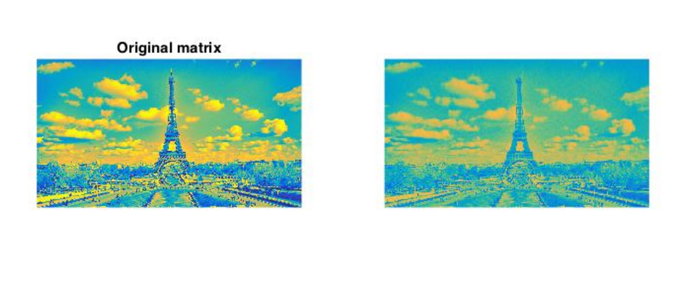
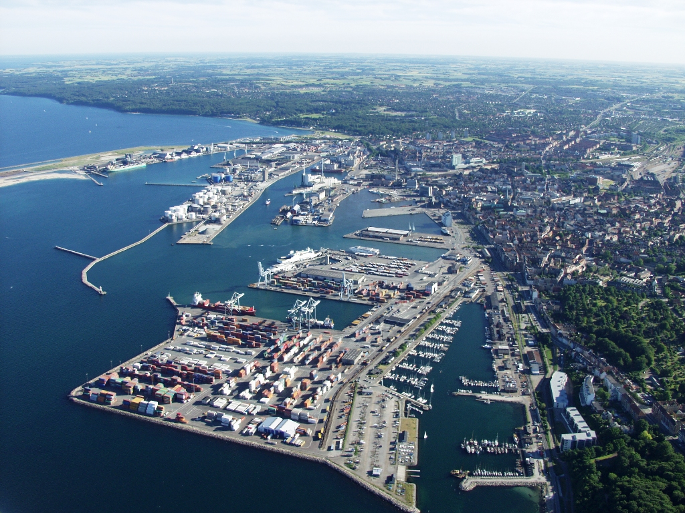
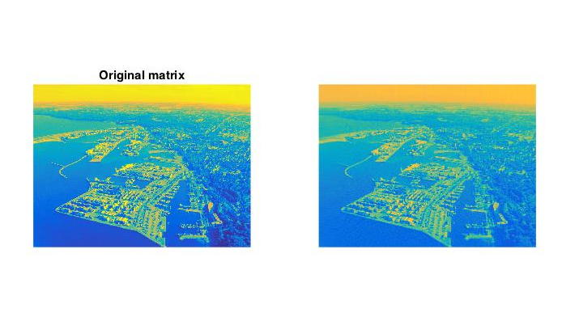
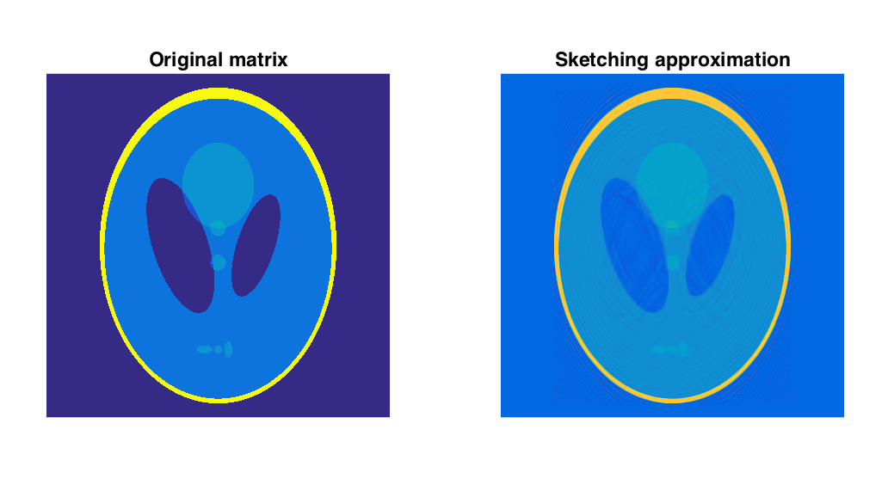
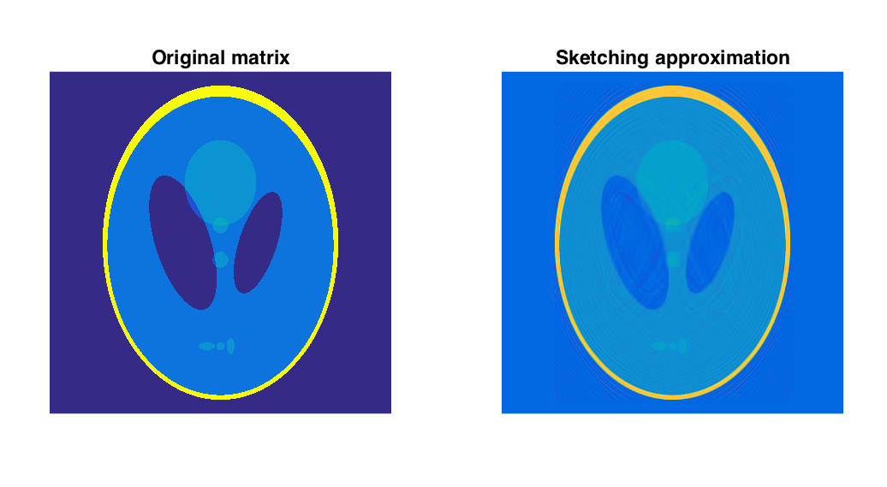
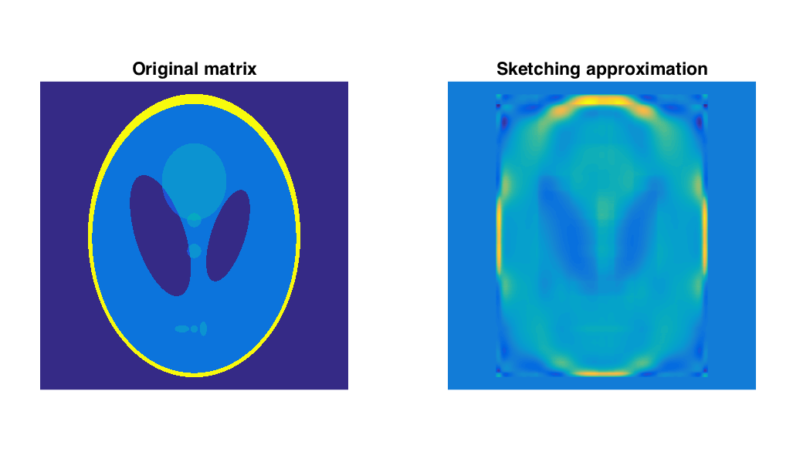
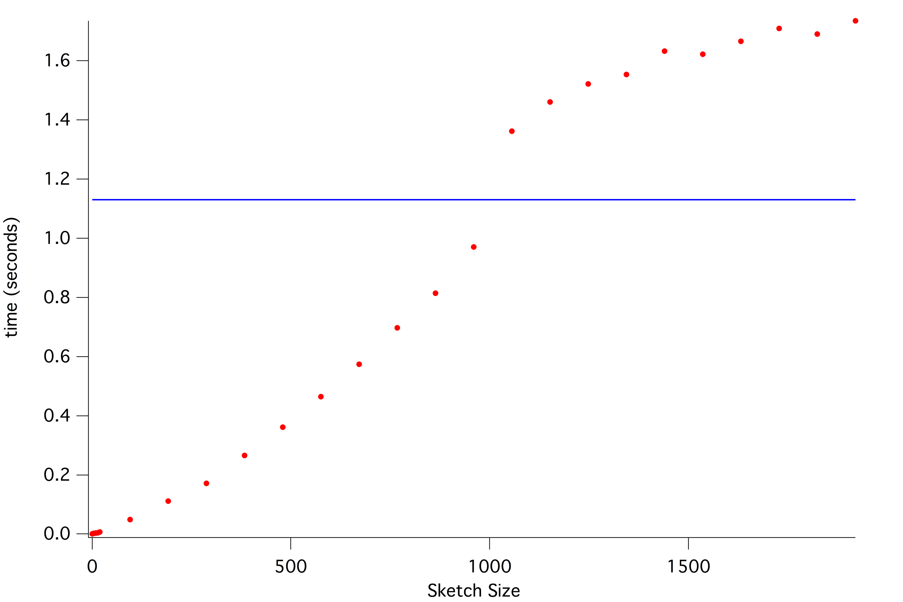
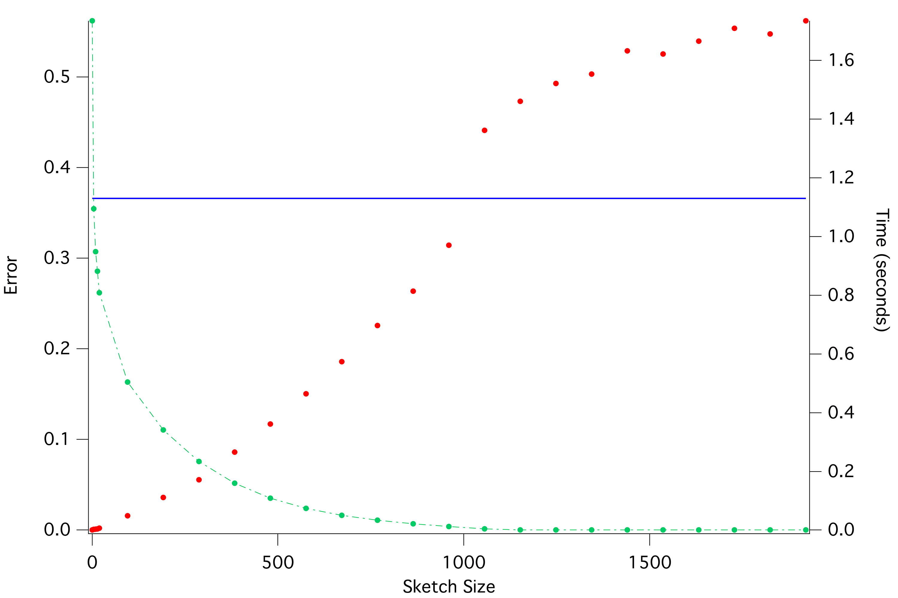

# K-SVD Tutorial

Here is an advanced tutorial on how to perform Rank K Singular Value Decomposition of a matrix. We used images to visualize this process

On this image

~~~{.c++}
string x_label = "arhaus_denmark";
sketchy::armadillo x_train = sketchy::armadillo(x_label);

sketchy::armadillo U;
sketchy::armadillo S;
sketchy::armadillo V;
sketchy::ops::k_svd(x_train, U, S, V, 5, 20);

U.save("u");
S.save("s");
V.save("v");
~~~
This code turns the image into a grey scale, normalizes it, and then performs k-SVD. 
Plotting using [MATLAB](http://www.mathworks.com/products/matlab/), We get 

As you can see, the image retrieved from signal, though not perfect, caputres the image while not losing too much information.

Here are more examples

S = 200

S = 100

K = 5, S = 20

Details get more lost with lower rank and dimensionality, but speed of computation goes down as well. 

Here you can see correlation of error, time and sketch size

Error decreases with sketch size asymptotically to zero. This makes sense as since the actual matrix had a size of 1000 rows. 