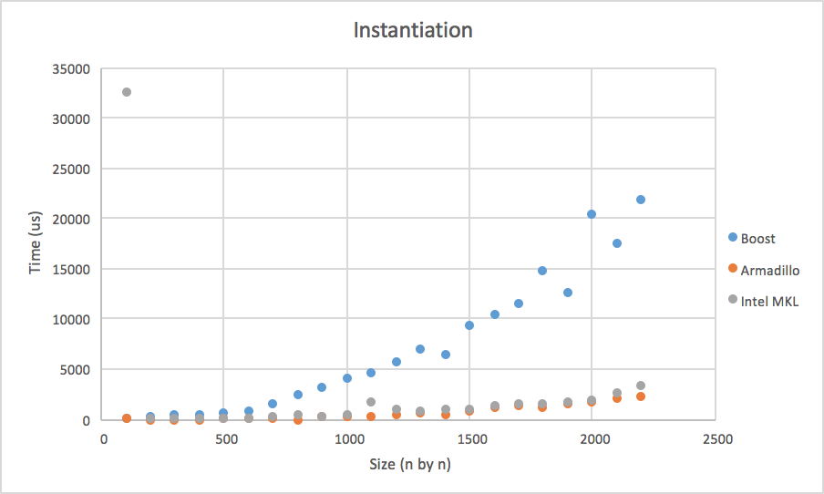
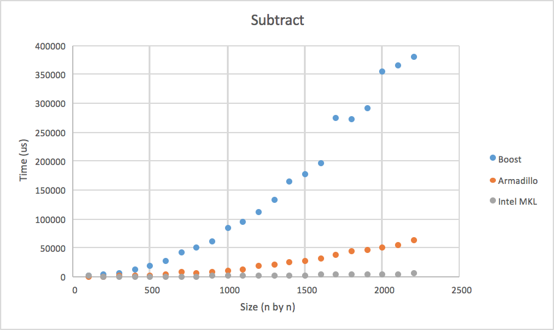
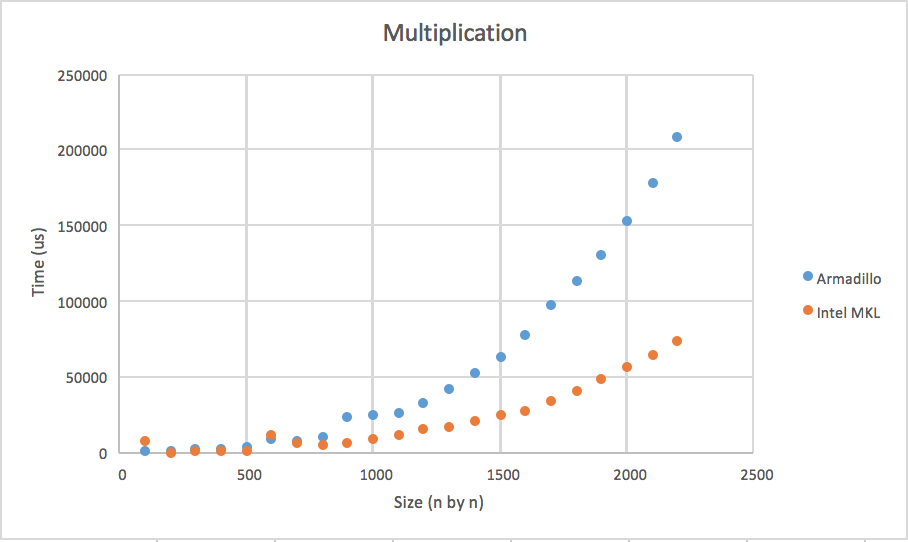
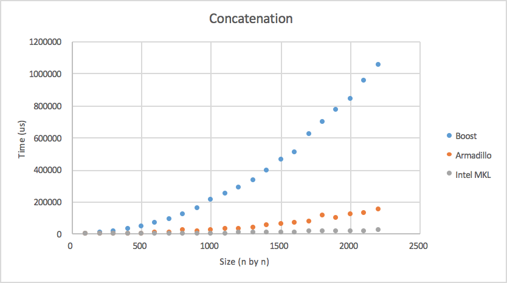
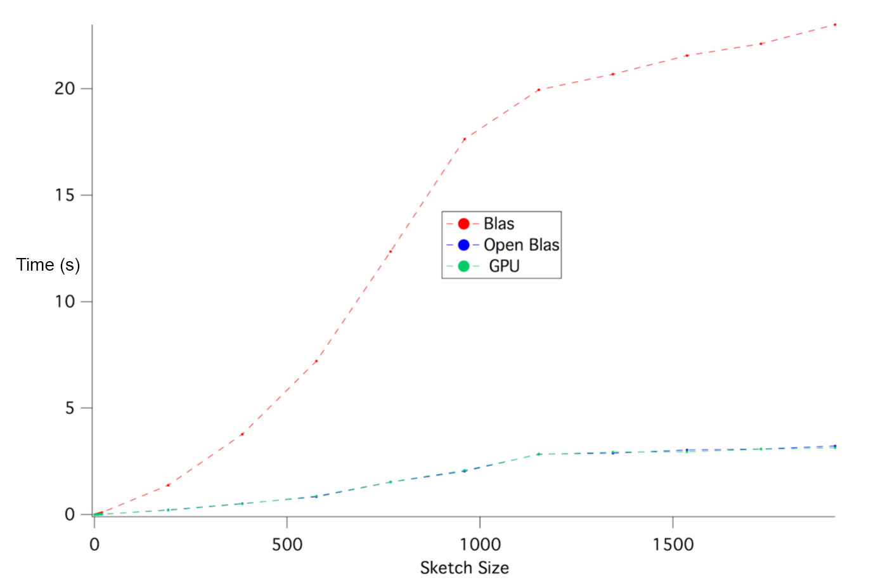
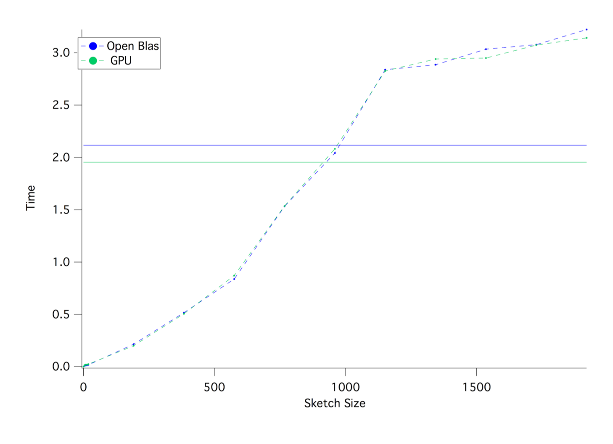

# Performance

## Boost vs. Armadillo vs. Intel
We compared various CPU backed libraries in this demo. We did not include NVBlas as the machine with Nvidea GPU had an AMD processor which might not have provided an accurate data for Intel MKL
\ 

Boost is a several times slower (3-10x), while armadillo and intel are equally fast

Interestingly, Intel performed the worst, followed by boost then Armadillo. This is because Armadillo's library rand_n function is optimized more so

Just like in instantiation, Boost trailed while the other two remained similar

In multiplication, the boost implementation of prod() clearly lags behind Intel and Armadillo's 

With Boost's data removed, one can see that Intel MKL is vastly faster than Armadillo's

Like before, Boost is slowe (7x), with Intel edging Armadillo slightly

On the topic of GPU vs. CPU, here is an example data from performing **K-SVD**
on matrix of various sketch sizes

As you can see, cpu backed Blas, which is used by Boost, is clearly outperformed by GPUs. 
When comparing Open Blas to CUDA,

The difference is minimal until sketch size goes up substantially. We believe this is because even though GPU has an edge in heavy operations like matrix multiplication, this is not apparent in small matrices as the cost of moving memory between CPU and GPU outweighs the gain of parallel computation.

