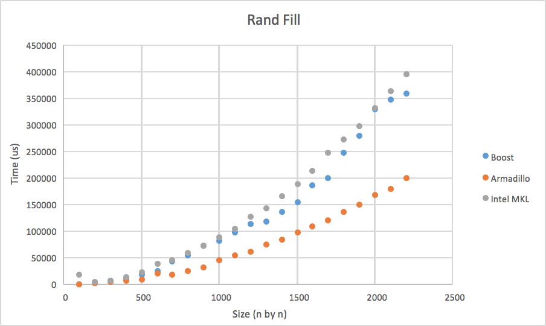

# Performance

## Boost vs. Armadillo vs. Intel

Boost is a several times slower (3-10x), while armadillo and intel are equally fast

Interestingly, Intel performed the worst, followed by boost then Armadillo. This is because Armadillo's library rand_n function is optimized more so

Just like in instantiation, Boost trailed while the other two remained similar

In multiplication, the boost implementation of prod() clearly lags behind Intel and Armadillo's 

With Boost's data removed, one can see that Intel MKL is vastly faster than Armadillo's

Like before, Boost is slowe (7x), with Intel edging Armadillo slightly